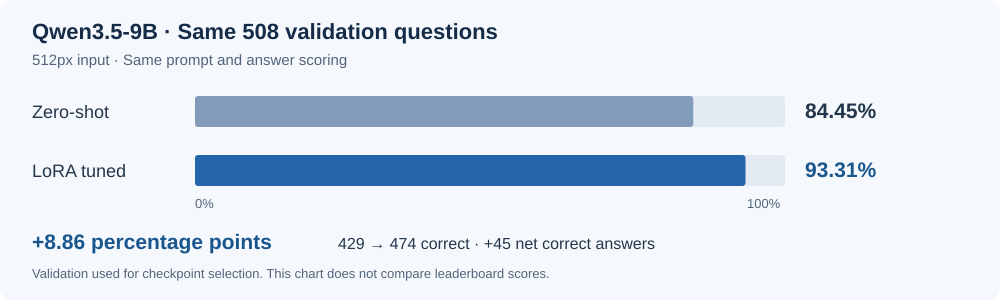
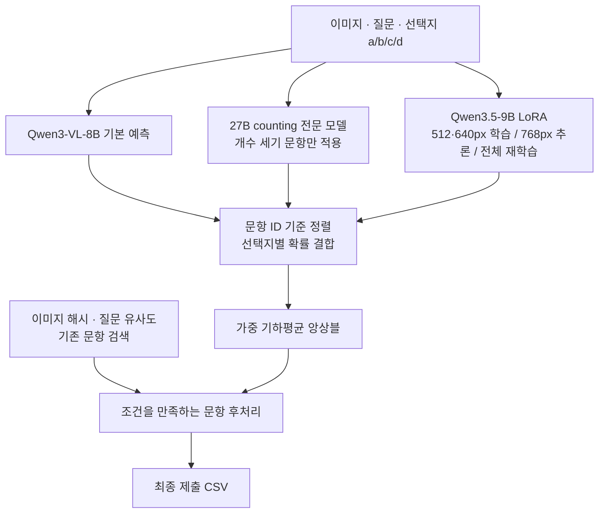

# SSAFY AI Challenge · 이미지 질의응답

**이미지와 질문을 보고 4개 선택지 중 정답을 고르는 VQA 과제입니다.** 사전학습 모델의 성능을 확인한 뒤 LoRA 학습, 문항 유형별 모델 구성, 여러 해상도의 예측 결합을 실험했습니다.

**최종 Private 5위 · Public 최고 점수 0.94994**

| 구분 | 내용 |
|---|---|
| 기간 / 형태 | 2026.08.28–31 · 개인 프로젝트 |
| 수행 범위 | 데이터 구성, 모델 학습·평가, 앙상블, 제출 결과 검증 |
| 주요 기술 | Python · PyTorch · Transformers · PEFT/LoRA · Qwen VLM |
| 실험 환경 | Google Colab · A100 80GB |

## 1. 과제와 접근

물체의 **개수·색상·재질·종류** 등을 묻는 이미지 질문에 답하는 과제였습니다. 짧은 대회 기간과 GPU 자원을 고려해 다음 세 가지에 집중했습니다.

- **학습 효과 확인:** 같은 검증 문항으로 zero-shot과 LoRA 학습 결과를 비교했습니다.
- **문항별 약점 보완:** 전체 문항을 처리하는 모델과 개수 세기(counting) 전용 모델의 역할을 나눴습니다.
- **예측 결과 재사용:** 모델별 선택지 확률을 저장해, 재추론 없이 해상도와 앙상블 가중치를 비교했습니다.

## 2. 주요 결과



| 평가 | 결과 | 비고 |
|---|---|---|
| Qwen3.5-9B zero-shot | 429 / 508 정답 · **84.45%** | 512px 입력, 학습 전 기준 성능 |
| Qwen3.5-9B LoRA | 474 / 508 정답 · **93.31%** | 같은 문항·입력 해상도·추론 방식으로 비교 |
| 학습 전후 변화 | **+8.86%p · 정답 45개 순증가** | 최종 앙상블 이전의 단일 모델 검증 결과 |
| 대회 제출 기록 | **Public 최고 0.94994 · 최종 Private 5위** | 보관한 제출 기록과 확인한 최종 순위 |
| 제출 재현 | **5,074개 ID·답안 전체 일치** | 보관한 예측을 `ensemble.py`로 다시 결합 |

508문항은 체크포인트 선택에도 사용한 **검증셋**입니다. 독립 테스트 결과나 대회 점수와 직접 비교하지 않습니다. 이후 전체 데이터 재학습에는 이 검증셋도 포함됐습니다. [평가 조건과 상세 결과](docs/RESULTS.md)

## 3. 최종 예측 구조



모델의 a/b/c/d 확률을 **가중 기하평균으로 결합**했습니다. ID를 기준으로 행을 맞추고 누락·중복 여부를 검사한 뒤 최종 답을 선택합니다. [최종 앙상블 코드](ensemble.py)

## 4. 주요 구현과 판단

### 학습 전후를 같은 조건에서 비교

학습 데이터의 마지막 10%인 508문항을 검증용으로 고정했습니다. Qwen3.5-9B의 vision·language 모듈에 LoRA를 적용하고, epoch별 정답 수와 정답 확률을 기록해 체크포인트를 선택했습니다.

추가 학습에는 dev 데이터의 5개 후보 답변 중 **4개 이상 일치한 의사 라벨**을 사용했습니다. 특정 유형의 데이터가 지나치게 많아지지 않도록 유형별 추가량을 해당 gold 학습 데이터 수의 약 75%로 제한했습니다.

- 결과: zero-shot 대비 검증 정답 수 **429 → 474개**
- 코드: [512px 학습·평가 노트북](notebooks/02_Qwen3_5_9B_512_VQA.ipynb)

### 모델 크기보다 문항별 역할과 해상도를 조정

개수 세기에 27B 모델을 적용했지만 전체 성능 개선은 제한적이어서, 이후 실험은 학습 효율과 성능을 고려한 9B 모델에 집중했습니다. 512px·640px 학습 결과와 768px 추론 결과를 각각 저장하고 조합별 효과를 비교했습니다.

최종 구성에서는 27B 모델을 counting 문항에만 사용하고, 나머지 문항에는 전체 VQA 모델의 예측을 활용했습니다. 최종 제출에 사용한 학습·추론 경로를 `notebooks`에 정리했습니다.

- 코드: [counting 학습](notebooks/01_Qwen3_8_27B_Counting_LoRA.ipynb) · [640px 학습](notebooks/03_Qwen3_5_9B_640_VQA.ipynb) · [768px 추론](notebooks/04_Qwen3_5_9B_768_Inference.ipynb)

### 최종 답안을 재현 가능한 형태로 정리

검색 후보는 train의 정답과 dev 후보 답변의 다수결 의사 라벨로 구성했습니다. 후보의 답안 텍스트를 현재 문항의 선택지에 맞춘 뒤, 이미지 해시 거리와 질문 유사도 조건을 만족하는 결과를 제한적으로 적용했습니다. 이 후처리까지 포함한 최종 수식을 `ensemble.py`로 분리했고, 보관한 입력으로 당시 제출한 **5,074개 답안을 모두 재현**했습니다.

- 코드: [앙상블](ensemble.py) · [검색 후처리](retrieval/apply_duplicate_retrieval.py)
- 검증 내용: 저장한 예측의 결합 결과를 확인했습니다. GPU 재학습이나 대회 서버 점수 재측정은 하지 않았습니다.

## 5. 기술별 역할

| 기술 | 사용한 부분 |
|---|---|
| PyTorch · Transformers | VLM 로드, 학습, 선택지 확률 추론 |
| PEFT / LoRA | 저랭크 어댑터를 추가해 모델 미세 조정 |
| Pandas · NumPy | 문항 ID 정렬, 확률 결합, 평가 결과 집계 |
| Pillow · 이미지 해시 | 이미지 처리와 중복 후보 분석 |
| Colab · Drive | GPU 실험, 체크포인트·예측 파일 보관 |

학습·앙상블 코드 초안과 오류 탐색에는 Claude를 활용했습니다. 실험 우선순위, 생성 코드의 동작 확인, 모델 선택과 최종 조합은 직접 판단했습니다.

## 6. 코드와 실행

```text
notebooks/        최종 구성에 사용한 학습·추론 노트북 5개
ensemble.py       최종 확률 결합과 검색 후처리 재현
retrieval/        이미지 중복·질문 유사도 분석
docs/             평가 조건과 실행 안내
archive/          이전 실험 참고 자료
```

보관한 예측 확률과 검색 후보가 있으면 GPU 없이 최종 결합을 실행할 수 있습니다.

```sh
pip install -r requirements.txt
python ensemble.py --data-root /path/to/local-artifacts --output outputs/submission.csv
```

대회 데이터·문항별 예측 파일·모델 가중치는 저장소에 포함하지 않았습니다. 학습 노트북은 Colab/Drive 경로와 GPU 환경을 별도로 준비해야 합니다.

[입력 파일 구성과 실행 안내](docs/REPRODUCING.md) · [평가 조건과 결과](docs/RESULTS.md)
